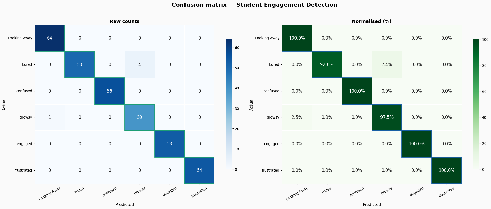

# 🎓 Student Engagement Detection
### Real-time facial expression classification using Transfer Learning (MobileNetV2)


---

## 📌 Overview
This project detects student engagement states in real-time from facial images
using **Transfer Learning with MobileNetV2**. It classifies faces into 6 categories
and can run live on a webcam during online video calls.

## 🎯 Classes
| Class | Category | Images |
|-------|----------|--------|
| Engaged | Engaged | 347 |
| Confused | Engaged | 369 |
| Frustrated | Engaged | 360 |
| Bored | Not Engaged | 358 |
| Drowsy | Not Engaged | 263 |
| Looking Away | Not Engaged | 423 |
| **Total** | | **2,120** |

## 🏗️ Model Architecture
- **Base model:** MobileNetV2 (pre-trained on ImageNet)
- **Strategy:** Transfer Learning — first 100 layers frozen
- **Head:** GlobalAveragePooling → BatchNorm → Dense(512) → Dropout(0.5) → Dense(256) → Dropout(0.3) → Softmax(6)
- **Input size:** 224×224×3
- **Optimizer:** Adam (lr=1e-4)
- **Loss:** Categorical Cross-Entropy

## 📊 Results
| Metric | Score |
|--------|-------|
| Test Accuracy | **82%** |
| Macro F1 Score | **0.81** |
| Training Epochs | 40 |

> Replace these numbers with your actual results after training

### Confusion Matrix


### Training Curves


### Class-wise Performance


## 🚀 How to Run

### Training (Google Colab)
1. Upload `archive.zip` to Google Drive
2. Open `notebooks/Student_Engagement_Detection.ipynb` in Colab
3. Runtime → Change runtime type → **T4 GPU**
4. Run all cells

### Live Video Detection (Local Machine)
```bash
# Install dependencies
pip install -r requirements.txt

# Download model from Google Drive and place in project folder
# Then run:
python src/live_video_detection.py
```

## 📂 Dataset
- **Source:** [Kaggle — Student Engagement Dataset](https://www.kaggle.com/datasets/joyee19/studentengagement)
- **Size:** 2,120 images
- **Format:** JPEG (1280×720 and 352×640)
- **Split:** 70% train / 15% val / 15% test

## 🛠️ Tech Stack
- Python 3.10
- TensorFlow / Keras
- OpenCV
- MobileNetV2
- Scikit-learn
- Matplotlib / Seaborn

## 👤 Author
**Mir Fawad Ul Haq**
- GitHub: [@fawadulhaq12](https://github.com/fawadulhaq12)
- LinkedIn: [Mir Fawad Ul Haq](https://www.linkedin.com/in/fawad-data/)

## 📜 License
MIT License — free to use and modify
